 

## 👋 Hey, I'm Numan

I'm a **visual and product designer** who cares about the details people feel but rarely notice: the spacing that makes a screen calm, the color that makes a brand memorable, the motion that makes an app feel alive.

I work across the whole journey, **from the first sketch to the shipped product**. When a tool I need doesn't exist, I design it *and* build it, using code and AI to turn ideas into things people can actually use.

 

## ✦ What I do

<table>
  <tr>
    <td width="50%" valign="top">
      <h3>📱 Product & UI/UX</h3>
      Apps, dashboards and websites that are clear, fast and a pleasure to use. Information architecture, user flows, wireframes, high-fidelity UI and design systems.
    </td>
    <td width="50%" valign="top">
      <h3>🎨 Brand Identity</h3>
      Logos, brand books, icon sets and visual languages that stay consistent from a business card to a billboard.
    </td>
  </tr>
  <tr>
    <td width="50%" valign="top">
      <h3>✏️ Illustration & Motion</h3>
      Custom illustrations, textured and grain art, social creatives, animated graphics and short videos that make people stop scrolling.
    </td>
    <td width="50%" valign="top">
      <h3>⚡ Design × Code × AI</h3>
      Interactive websites in Framer, native macOS tools, and AI-powered workflows that take designs from Figma to a working product.
    </td>
  </tr>
</table>

 

## 🧰 Toolbox

  

  
  
  
  
  
  
  

 

## 💡 How I work

- **People first.** Every pixel should help someone get something done.
- **Details matter.** Typography, spacing, color and motion are where good becomes great.
- **Ship it.** A real thing in people's hands beats a perfect mockup in a folder.
- **Always learning.** New tools, new mediums, new ways to tell a story.

 

## 🤝 Let's work together

I'm open to **freelance projects and collaborations**. That could be a product that needs a fresh look, a brand that needs an identity, or an idea that needs to become real.

  

Tell me a little about what you're making, and let's talk. ✨

 

  

